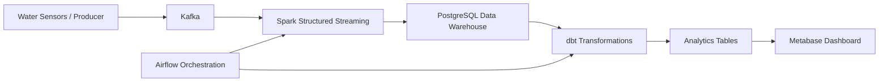
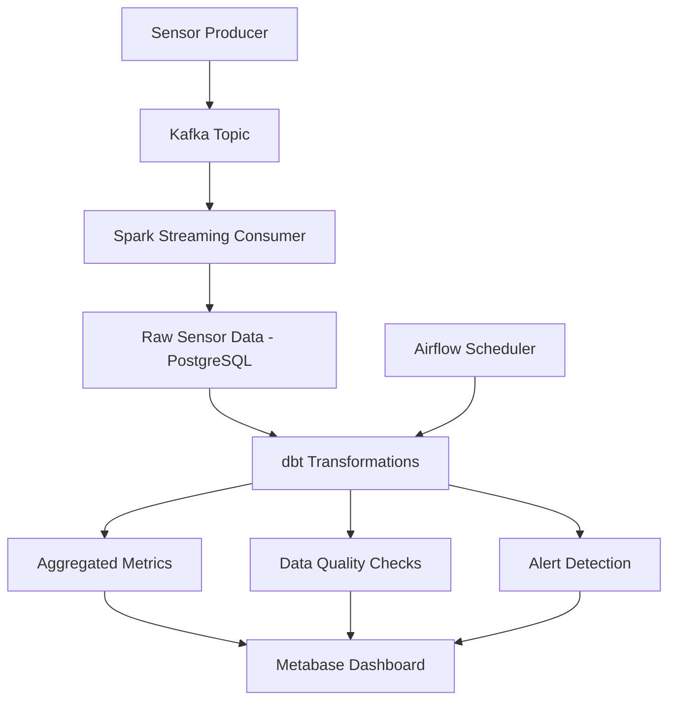

# Water Sensor Streaming Data Pipeline

## Overview

This project implements a **modern end-to-end data engineering pipeline** for processing water sensor data in real time.

The pipeline simulates sensor events, streams them through Kafka, processes them with Spark Streaming, stores the data in PostgreSQL, transforms it using dbt, orchestrates the workflow with Airflow, and visualizes insights in Metabase.

This project demonstrates a **production-like data platform architecture** commonly used in modern data teams.

---

# Architecture



---

# Data Pipeline



---

# Tech Stack

| Layer                  | Technology                 |
| ---------------------- | -------------------------- |
| Data Streaming         | Kafka                      |
| Stream Processing      | Spark Structured Streaming |
| Data Warehouse         | PostgreSQL                 |
| Data Transformation    | dbt                        |
| Workflow Orchestration | Airflow                    |
| Data Visualization     | Metabase                   |
| Infrastructure         | Docker                     |

---

# Project Structure

```
water-sensor-pipeline
│
├── airflow
│   └── dags
│       └── water_pipeline_dag.py
│
├── dbt
│   ├── models
│   │   ├── water_sensor_agg.sql
│   │   ├── water_sensor_alerts.sql
│   │   ├── water_sensor_quality.sql
│   │   └── pipeline_health.sql
│   │
│   └── schema.yml
│
├── spark
│
├── docker-compose.yaml
├── sensor_producer.py
├── spark_streaming.py
└── requirements.txt
```

---

# Data Flow

1. **Sensor Producer**

   * Simulates water sensor readings.

2. **Kafka**

   * Streams sensor events into a Kafka topic.

3. **Spark Streaming**

   * Consumes Kafka events.
   * Processes data in real time.

4. **PostgreSQL**

   * Stores processed sensor data.

5. **dbt**

   * Creates analytics models:
   * sensor aggregation
   * data quality checks
   * anomaly detection.

6. **Airflow**

   * Orchestrates dbt jobs.
   * Runs data pipelines every 5 minutes.

7. **Metabase**

   * Visualizes sensor metrics and alerts.

---

# Running the Project

Start the full data platform:

```bash
docker compose up -d
```

Services available:

| Service  | URL                   |
| -------- | --------------------- |
| Airflow  | http://localhost:8088 |
| Metabase | http://localhost:3000 |
| Spark UI | http://localhost:8080 |

---

# Example Use Cases

This pipeline can be adapted for:

* IoT sensor monitoring
* Smart city infrastructure
* Environmental monitoring
* Industrial telemetry pipelines

---

# Key Features

* Real-time streaming pipeline
* Data quality checks with dbt
* Automated orchestration with Airflow
* End-to-end containerized architecture
* Analytics dashboard with Metabase

---

# Author

**Yacouba Diallo**

Data Engineering Portfolio Project
